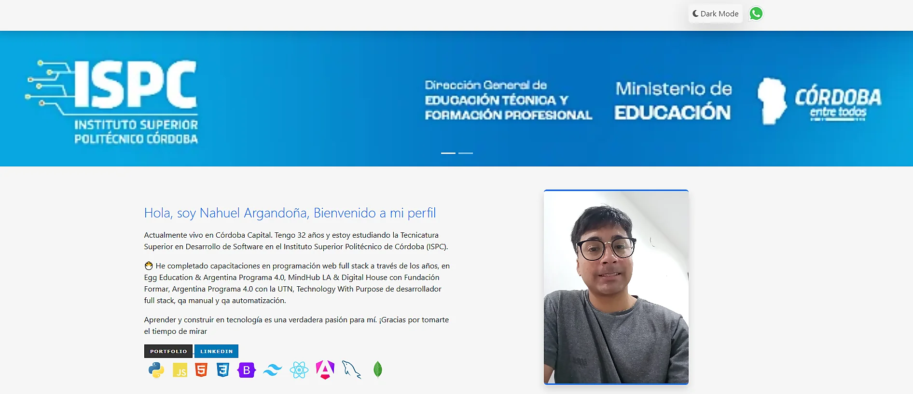

# Captura de pantalla
<picture></picture>

# Portfolio — Nahuel Argandoña
Este proyecto es un Portfolio personal desarrollado para mostrar información profesional, experiencia, educación y proyectos destacados. Incluye diseño responsive, animaciones, modo oscuro y enlaces a redes sociales, tambien en las carpeta backend se uso "Django" para crear una Api rest y en la carpeta portfolio se uso "Angular", para trabajar el frontend dinamico, se llevo al siguiente nivel el proyecto.

## Características: 
- Diseño Responsive con Bootstrap 5 y CSS personalizado.
- Modo claro/oscuro con persistencia usando JavaScript.
- Animaciones al hacer scroll con AOS (Animate On Scroll).

## Secciones:

- Presentación y sobre mí.
- Experiencia laboral.
- Educación.
- Proyectos destacados con demo y enlace al código.
- Reproductor de Spotify incrustado.
- Enlaces rápidos a WhatsApp, LinkedIn y GitHub.
- Botón de volver arriba.

## Tecnologías utilizadas:

- HTML5
- CSS3 + Normalize.css
- JavaScript
- Bootstrap 5
- Font Awesome
- AOS (Animate On Scroll)

## Estructura del proyecto
- ├── backend/                # Backend Django
- ├── portfolio/              # Frontend Angular
- ├── assets/
- │   ├── icon/               # Íconos del sitio
- │   ├── carrousel/          # Imágenes del carrusel
- │   ├── profile/            # Imagen de perfil
- │   ├── experiencia/        # Logos empresas
- │   ├── estudios/           # Logos instituciones educativas
- │   └── proyectos/          # Imágenes de proyectos
- ├── styles.css              # Estilos personalizados
- ├── script.js               # Funciones JS (tema, scroll, etc.)
- └── index.html              # Página principal